# Bank_Loan_Project
Finance Domain | Bank Loan Analysis

This repository contains the code and documentation for the Customized Bank Loan Report project. Below you'll find the domain knowledge in `domain_knowledge.md`, problem statement in `problem_statement.md` and an overview of the solution implemented using SQL and Power BI.

## Domain Knowledge

To read the domain knowledge, please refer to  [](domain_knowledge.md)

## Problem Statement

To read the problem statement, please refer to [](problem_statement.md)

### Power BI Implementation

Click the button below to view the Power BI dashboard:

[](https://app.powerbi.com/view?r=eyJrIjoiNzAxODcyODctMjM4Ni00ODc3LWExNjgtM2UxZWEwMmNjNGM1IiwidCI6ImI2NDE3Y2QwLTFmNzMtNDQ3MS05YTM5LTIwOTUzODIyYTM0YSIsImMiOjN9)

### SQL Implementation

# KPI'S
### 1. Total Loan Applications

```sql 
select count(id) as total_loan_applications from bank_loan_data;
```
<strong>Output:</strong><br>
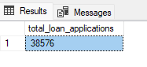


### 2. Month to Date Loan Applications

```sql
SELECT count(id) as MTD_loan_applications from bank_loan_data
WHERE MONTH(issue_date) = 12 AND YEAR(issue_date) = 2021;
```
or
```sql
# to make it dynamic rather than getting static month and date
SELECT COUNT(id) AS MTD_loan_applications 
FROM bank_loan_data 
WHERE YEAR(issue_date) = YEAR(GETDATE()) 
AND MONTH(issue_date) = MONTH(GETDATE());
```
<strong>Output:</strong><br>
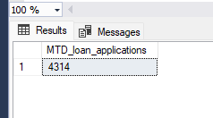

### 3. Month to Date Total Funded Amount

```sql
SELECT SUM(loan_amount) as MTD_Total_Funded_Amount from bank_loan_data
WHERE MONTH(issue_date) = 12 AND YEAR(issue_date) = 2021;
```

<strong>Output:</strong><br>
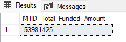

### 4. Month over Month Total Funded Amount
```sql

WITH MonthlyTotals AS (
    SELECT 
        YEAR(issue_date) AS Year,
        MONTH(issue_date) AS Month,
        SUM(total_payment) AS Monthly_Total_Amount_Received
    FROM 
        bank_loan_data
    WHERE 
        YEAR(issue_date) = 2021 -- Filter by the desired year
    GROUP BY 
        YEAR(issue_date),
        MONTH(issue_date)
),
MonthOverMonth AS (
    SELECT 
        t1.Year,
        t1.Month,
        t1.Monthly_Total_Amount_Received AS Current_Month_Amount,
        t2.Monthly_Total_Amount_Received AS Previous_Month_Amount,
        t1.Monthly_Total_Amount_Received - t2.Monthly_Total_Amount_Received AS Month_Over_Month_Amount
    FROM 
        MonthlyTotals t1
    LEFT JOIN 
        MonthlyTotals t2 ON t1.Year = t2.Year AND t1.Month = t2.Month + 1
)
SELECT 
    Year,
    Month,
    Current_Month_Amount,
    Previous_Month_Amount,
    Month_Over_Month_Amount
FROM 
    MonthOverMonth
ORDER BY 
    Year,
    Month;

```
<strong>Output:</strong><br>
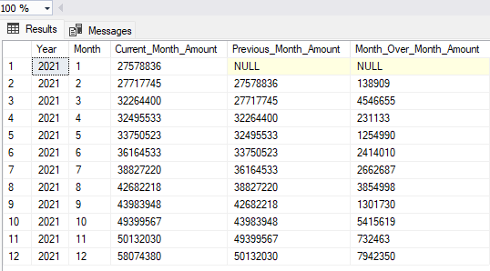

### 5. Average Interest Rate for year 2021
```sql
SELECT 
	ROUND(AVG(int_rate)*100,2) as average_interest_rate
FROM
	bank_loan_data
WHERE
	YEAR(issue_date) = 2021;
```

<strong>Output:</strong><br>
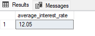

### 5. Month over Month Average Interest Rate

```sql
WITH MonthlyInterestRate AS(
	SELECT
		YEAR(issue_date) as Year,
		MONTH(issue_date) as Month,
		ROUND(AVG(int_rate)*100,2) as monthly_average_interest_rate
	FROM
		bank_loan_data
	WHERE
		YEAR(issue_date) = 2021
	GROUP BY
		YEAR(issue_date),
		MONTH(issue_date)
), 
MonthOverMonthInterestRate AS(
	SELECT
		MIR1.Year,
		MIR1.Month,
		MIR1.monthly_average_interest_rate as Current_Month_Interest_Rate,
		MIR2.monthly_average_interest_rate as Previous_Month_Interest_Rate,
		ROUND((MIR1.monthly_average_interest_rate - MIR2.monthly_average_interest_rate),2) as Month_Over_Month_Interest_Rate
	FROM
		MonthlyInterestRate MIR1
	LEFT JOIN
		MonthlyInterestRate MIR2
	ON
		MIR1.Year = MIR2.Year
		and MIR1.Month = MIR2.Month+1
)
SELECT
	Year, 
	Month, 
	Current_Month_Interest_Rate, 
	Previous_Month_Interest_Rate, 
	Month_Over_Month_Interest_Rate 
FROM 
	MonthOverMonthInterestRate 
ORDER BY
	Year, 
	Month;

```

<strong>Output:</strong><br>
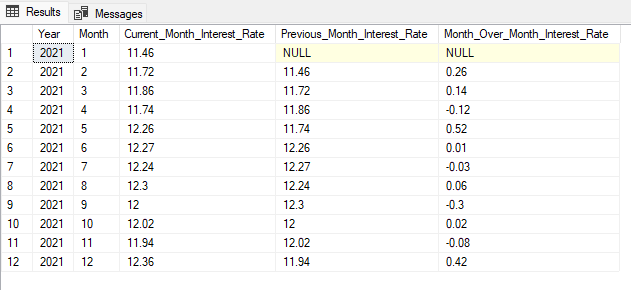

### 6. Average Debt to Income Ratio

```sql
SELECT
	ROUND(AVG(dti)*100,4) as average_debt_to_income_ratio
FROM
	bank_loan_data
```

<strong>Output:</strong><br>
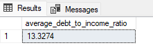

## Good Loan Vs Bad Loan KPI's

### 7.1 Good Loan Percentage

```sql
SELECT
	COUNT(CASE WHEN loan_status = 'Fully Paid' OR loan_status = 'Current' THEN id END)*100.0
	/
	COUNT(id) as Good_Loan_Percentage
FROM
	bank_loan_data
```
or
```sql
SELECT
	COUNT(CASE WHEN loan_status IN ('Fully Paid', 'Current') THEN id END)*100.0
	/
	COUNT(id) as Good_Loan_Percentage
FROM
	bank_loan_data
```
<strong>Output:</strong><br>
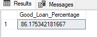

### 7.2 Good Loan Applications

```sql
SELECT
	count(id) as Good_Loan_Applications
FROM
	bank_loan_data
WHERE
	loan_status IN ('Fully Paid', 'Current');
```
<strong>Output:</strong><br>
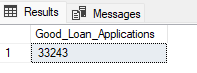

### 7.3 Good Loan Total Funded Amount

```sql
SELECT
	SUM(loan_amount) as Good_Loan_Funded_Amount
FROM
	bank_loan_data
WHERE
	loan_status IN ('Fully Paid', 'Current');

```
<strong>Output:</strong><br>
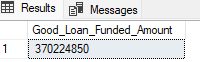

or (cast result to decimal type and using concat method to add millions in the suffix)

```sql
SELECT
	CONCAT(CAST(SUM(loan_amount)/1000000 AS DECIMAL(18,2)), ' millions') as "Good_Loan_Funded_Amount (in millions)"
FROM
	bank_loan_data
WHERE
	loan_status IN ('Fully Paid', 'Current');
```
<strong>Output:</strong><br>
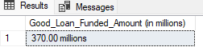

### 7.4 Good Loan Total Amount Received

```sql
SELECT
	CONCAT(CAST(SUM(total_payment)/1000000 AS DECIMAL(18,2)), ' millions') as Good_Loan_Amount_Received
FROM
	bank_loan_data
WHERE
	loan_status IN ('Fully Paid', 'Current');
```

<strong>Output:</strong><br>
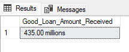

### 8.1 Bad Loan Percentage

```sql
SELECT
	COUNT(CASE WHEN loan_status = 'Charged Off' THEN id END)*100.0
	/
	COUNT(id) as Bad_Loan_Percentage
FROM
	bank_loan_data
```
<strong>Output:</strong><br>
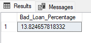

### 8.2 Bad Loan Applications

```sql

SELECT
	count(id) as Bad_Loan_Applications
FROM
	bank_loan_data
WHERE
	loan_status IN ('Charged Off');

```
<strong>Output:</strong><br>
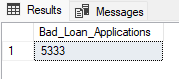

### 8.3 Bad Loan Total Funded Amount

```sql
SELECT
	CONCAT(CAST(SUM(loan_amount)/1000000 AS DECIMAL(18,2)), ' millions') as Bad_Loan_Total_Funded_Amount
FROM
	bank_loan_data
WHERE
	loan_status IN ('Charged Off');

```
<strong>Output:</strong><br>
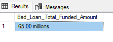

### 8.4 Bad Loan Total Amount Received
```sql
SELECT
	CONCAT(CAST(SUM(total_payment)/1000000 AS DECIMAL(18,2)), ' millions') as Bad_Loan_Amount_Received
FROM
	bank_loan_data
WHERE
	loan_status IN ('Charged Off');
```
<strong>Output:</strong><br>
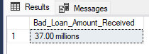
